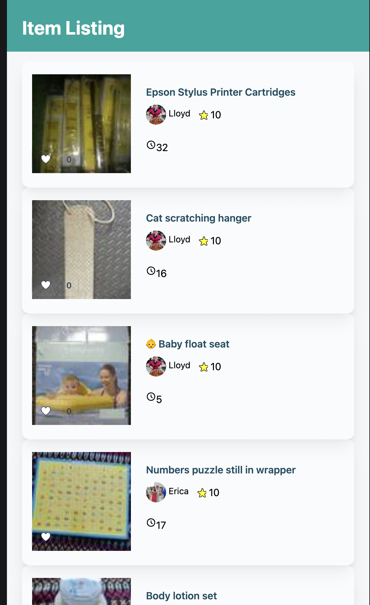

# Article Listing.

Displays list of items similar to Olio
### Setup Instruction
1. You must have the following dependencies installed:

   - Ruby 3
      - See [`.ruby-version`](.ruby-version) for the specific version.
   - Node 19
      - See [`.nvmrc`](.nvmrc) for the specific version.
   - PostgreSQL 14
   - [Chrome](https://www.google.com/search?q=chrome) (for headless browser tests)

If you don't have these installed, you can use [rails.new](https://rails.new) to help with the process.

2. Type the following command while in the project directory:
   `gem install bundler`
   `bundle install`
3. Run `bin/setup` in the terminal
4. Run `rails server` in the terminal
5. Open your browser of choice and go to `localhost:3000`

